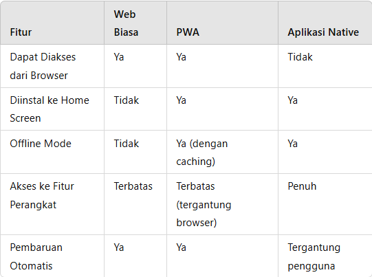

# Pengenalan 
## Apa Itu Progressive Web Apps (PWA)?
Progressive Web App (PWA) adalah jenis aplikasi web yang menggabungkan keunggulan situs web dan aplikasi mobile native. Aplikasi ini berjalan di browser, tetapi memiliki fitur seperti aplikasi native, seperti kemampuan offline, akses ke fitur perangkat, kecepatan loading yang tinggi, dan bisa diinstal ke home screen.

### Karakteristik Utama PWA
PWA memiliki beberapa karakteristik kunci yang membedakannya dari aplikasi web biasa:

1. **Responsif**: Berfungsi di berbagai perangkat dengan berbagai ukuran layar, seperti desktop, tablet, dan mobile.
2. **Progressive**: Menggunakan progressive enhancement, artinya PWA bisa berjalan di semua browser dan memberikan fitur tambahan di browser yang mendukung.
3. **Offline Mode**: Dapat beroperasi meskipun tidak ada koneksi internet menggunakan teknologi Service Worker untuk caching.
4. **Aksesibilitas** Native: Dapat diinstal di perangkat pengguna dan muncul di home screen, seperti aplikasi native.
5. **Update Otomatis**: Mengupdate secara otomatis tanpa perlu persetujuan pengguna.
6. **Aman**: Harus di-host di HTTPS untuk menjamin keamanan data pengguna.

### Perbandingan PWA, Web Biasa, dan Aplikasi Native

## Tools untuk Membuat PWA
- **Chrome DevTools**: Untuk menguji dan memonitor performa aplikasi serta memastikan PWA berjalan dengan baik.
- **Lighthouse**: Tool audit dari Google yang menyediakan laporan tentang performa, aksesibilitas, SEO, dan kriteria PWA.
- **Workbox**: Library dari Google untuk membuat Service Worker dan mengelola caching dengan mudah.